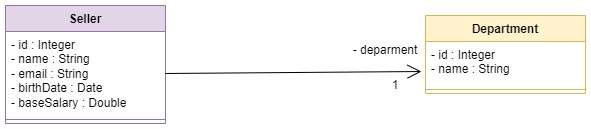
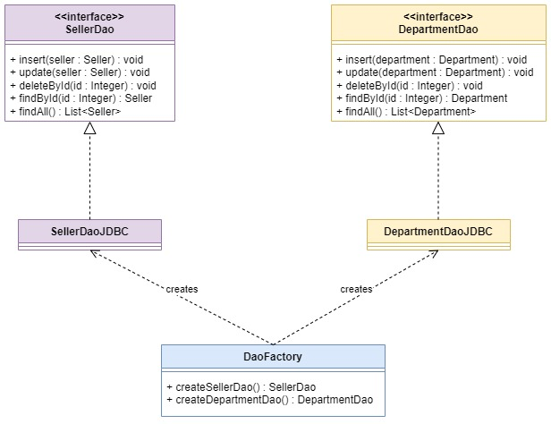

# JDBC & DAO

Academic project guided by Prof. Dr. Nélio Alves, aiming to practice the concepts of JDBC and DAO in Java.

## Objectives
- Understand the main features of JDBC in theory and practice
- Develop the basic structure of a project with JDBC
- Implement the DAO pattern manually with JDBC

<figure style="text-align:center;">
  
  <figcaption>UML Class Diagram - Entities: Seller and Department</figcaption>
</figure>

<figure style="text-align:center;">
  
  <figcaption>UML Class Diagram - DAO Patterns </figcaption>
</figure>

